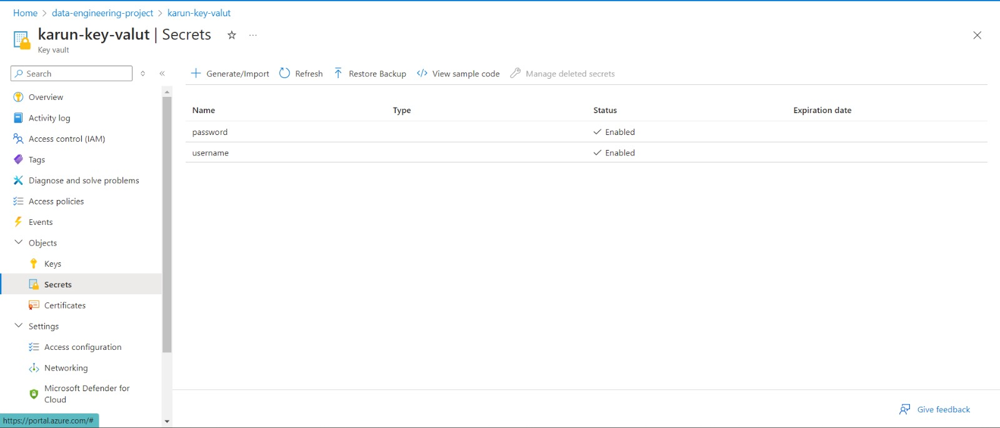
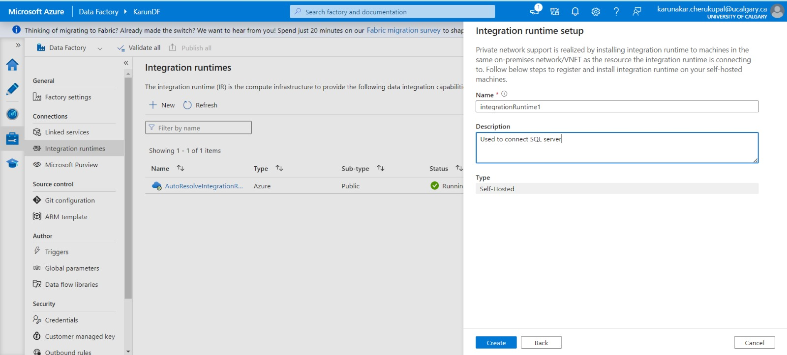
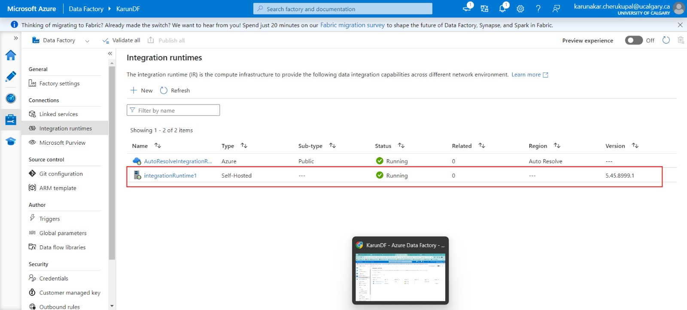
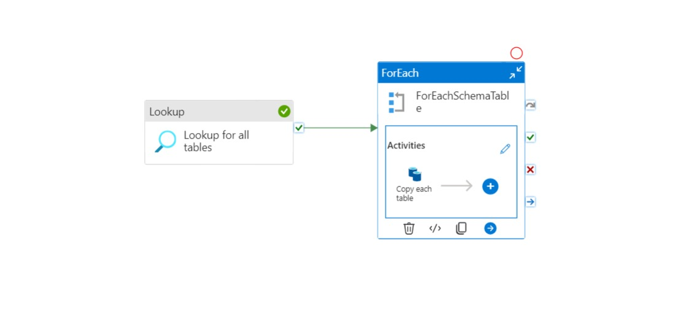
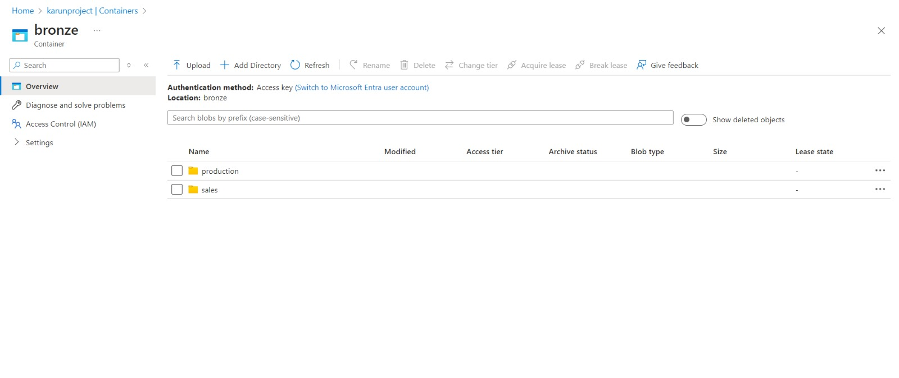

## Project Overview

This project focuses on migrating data from an on-premises SQL Server to Azure Data Lake using Azure Data Factory (ADF). It enables secure, automated data ingestion and storage, with future plans for data transformation using Databricks and analysis with Synapse and Power BI.

### Technologies Used:

- **Azure Data Factory (ADF)**
- **Azure Key Vault**
- **Azure Data Lake Storage**
- **SQL Server (On-Premise)**

## Project Structure

1. **Environment Setup**
   - Created a resource group containing:
     - Storage Account
     - Key Vault
     - Azure Data Factory
     
2. **Data Ingestion Process**
   - Configured the on-premises SQL Server to enable SQL authentication.
   - Created a SQL Server user with credentials and stored the username and password as secrets in Azure Key Vault.
   - Set up the **Integration Runtime** on the local machine to connect ADF with the on-premises SQL Server.
   - Tested the connection between ADF and the on-premises database.

   

   
     
     

3. **Azure Data Factory Pipeline**
   - Created a pipeline in ADF with the following activities:
     - **Lookup Activity**: To retrieve all the table names and schema from the SQL Server database.
     - **ForEach Activity**: Iterates over the output from the lookup activity.
     - **Copy Data Activity**: Transfers data from each SQL table to the corresponding folder in Azure Data Lake, saving it in Parquet format.

   - Ran and monitored the pipeline to ensure all data was successfully copied from the on-premises SQL Server to the Azure Data Lake.

   

4. **Data Format**
   - Data is stored in **Parquet** format within properly named folders based on the source SQL tables.

   

## Future Steps

1. **Data Transformation with Azure Databricks**
   - Use Databricks to clean, transform, and enrich the data stored in the Data Lake.

2. **Data Analysis with Azure Synapse and Power BI**
   - Leverage Synapse Analytics to analyze the data and integrate it with Power BI for visualization and reporting.

